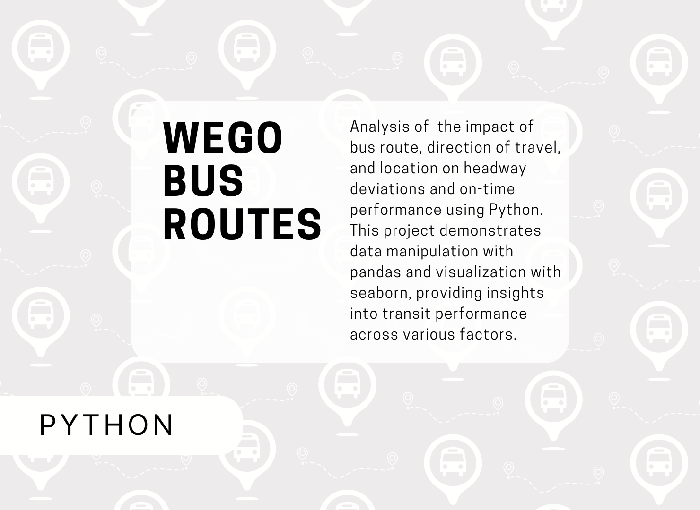

# WeGO Routes Project (Python)

This project analyzes how direction of travel, route, and location impact the headway (the time interval between bus arrivals) and on-time performance of WeGo Public Transit. The primary goal is to determine factors that contribute to either consistent or irregular service, such as bunching (multiple buses arriving close together) or gapping (long gaps between buses).

# Key Skills Used:
  * **Data Cleaning and Manipulation**: Utilized pandas for reading and cleaning the dataset, grouping data by route, direction, and location, and calculating performance metrics.
Created custom classifications for headway performance (e.g., "Bunching," "Gapping," "Acceptable") based on deviations from scheduled headways.
  * **Statistical Analysis:** Analyzed overall on-time performance and headway deviation, both on a system-wide level and by route, direction, and location.
Aggregated data to compute the mean scheduled headway and deviations across different bus routes and travel directions.
  * **Data Visualization:** Used matplotlib and seaborn to generate visualizations, such as bar plots showing on-time performance by route and direction, and stacked bar charts highlighting instances of bunching and gapping.
Applied customization techniques like axline markers for comparing performance against overall averages and custom color schemes for clear visualization.
  * **Advanced Python Programming:** Implemented custom functions for classifying headway status.Exported and organized code efficiently into reusable formats using nbformat to capture relevant code cells from Jupyter notebooks.

This analysis helps identify operational issues in bus scheduling by showing how factors like route and direction affect bus performance, providing data-driven insights for improving public transit reliability.
